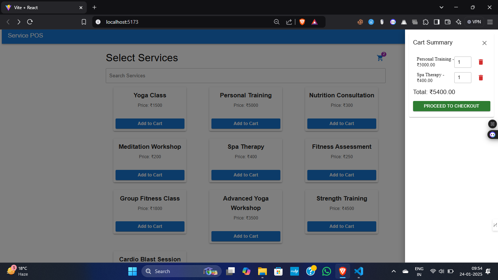
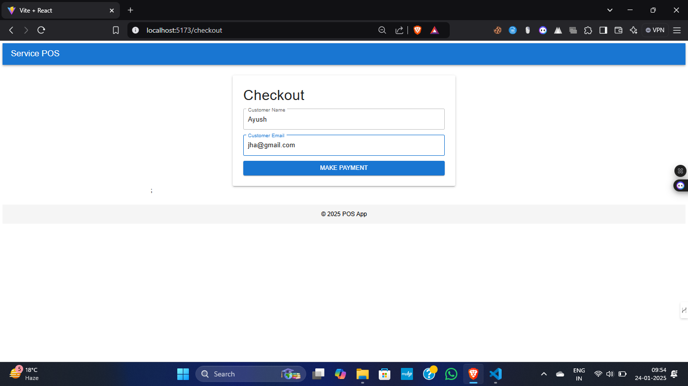
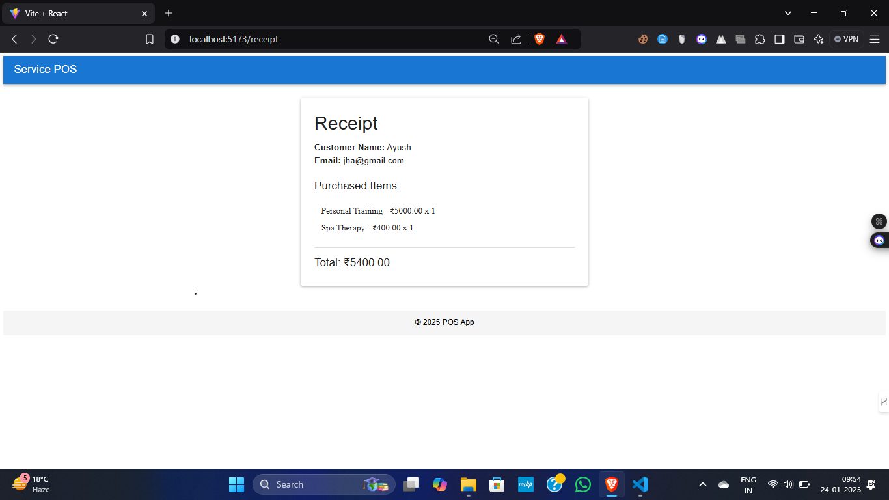

# Service Selection Application

This is a Service Selection Application built using React. It allows users to search for services, view a list of available services, and add them to their shopping cart. The cart is stored locally using `localStorage`, and users can view a summary of the items in their cart at any time.

---

## Live Demo

You can check out the live demo of the project here: <a href="https://pos-service-interface.onrender.com/" target="_blank">Live Demo</a>


## Features
- Service search functionality.
- Responsive layout with service cards displayed in a grid.
- Ability to add services to the cart.
- View cart summary in a side drawer.
- Persistent cart storage using localStorage.

---

## Technologies Used
- **React**: JavaScript library for building user interfaces.
- **Material-UI**: A popular React UI framework used for components and styling.
- **localStorage**: Used for persistent cart storage.

---


## Screenshots





## Installation

### Prerequisites
- Node.js and npm should be installed on your machine.

### Steps to run the project

1. Clone the repository:
   ```bash
   git clone https://github.com/Ayushjha298/pos-service-interface.git

2. Install dependencies:

   ```bash
      cd service-selection-app
      npm install
    ```


3. Run the application locally:

    Start the application::
   ```bash
    npm run dev
    ```
Deployment

Deployed on Render:

Frontend: [Frontend URL](https://pos-service-interface.onrender.com/)
   

## Contact

For any questions or feedback, please reach out to [ayushjha298@gmail.com](mailto:ayushjha298@gmail.com).

